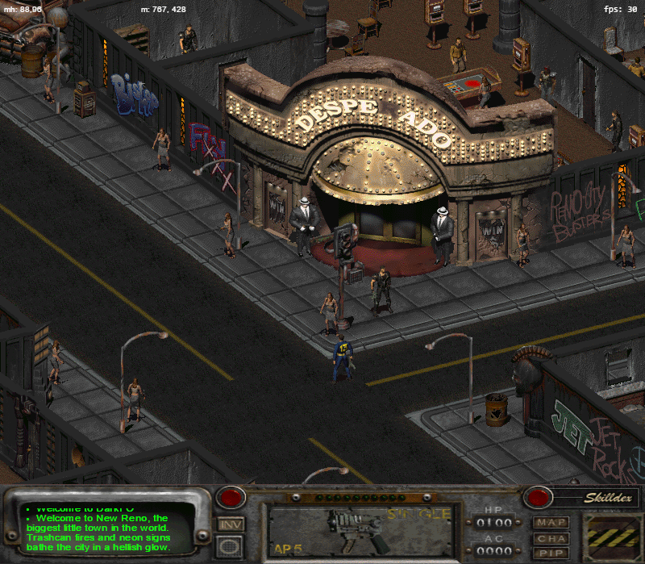

# DarkFO

A post-nuclear RPG remake

This is a modern reimplementation of the engine of the video game [Fallout 2](http://en.wikipedia.org/wiki/Fallout_2), as well as a personal research project into the feasibility of doing such.

It is written primarily in TypeScript and Python, and targets a modern (HTML 5) Web browser.

## Status

DarkFO is not a complete remake at this time.
A lot of core functionality works, but major parts are missing or need work.

If you're looking for documentation on how Fallout 2 works, or documentation on certain file formats, or
just want some tools to work with them, this project will be useful to you as well.

Here is a very rough list of what is known to work:

- Map loading
- Walking, running
- Talking to NPCs
- Bartering
- Some quests (a lot of the scripting works, majors quests can be completed)
- Some party members
- Some skills (lockpicking and repair, and some passive skills)
- Sound (scripted sound effects, music; not hardcoded sound effects, yet)

Some features are more middle ground:

- Combat works at an extremely basic level but not to a great degree (only the SMG and spear is really tested, you cannot swap ammo, etc.)
- No equippable armor
- The world map is rough and buggy, and on the area screens entrances are misplaced
- Random encounters work, but not all of the setups are implemented
- Lighting works, but has some minor bugs and inaccuracies. It is also particularly slow, especially outside of the WebGL backend.
- Saving and loading is at an alpha stage: it works to a basic degree, but is missing large features and is not tested. As such, consider it experimental.
- Some animations are off, particularly related to combat

Some features are not implemented at all:

- Leveling up (including XP, leveling stats/skills, etc.)
- The PipBoy map

and other minor features here and there.

If you'd like to contribute, those might be major parts to look into.

## Installation

To use this, you'll need a few things:

- A copy of Fallout 2 (already installed)

- Python 2.7

- [Pillow](https://pillow.readthedocs.io/en/4.0.x) (just `pip install pillow`)

- [NumPy](http://www.numpy.org/) (Windows binaries available [here](http://www.lfd.uci.edu/~gohlke/pythonlibs/#numpy).)

- The TypeScript compiler, installed via `npm install -g typescript` (you'll need [node.js](https://nodejs.org/en/)).

You'll need an HTTP server to run (despite being all static content) due to the way browsers sandbox requests.
If you're comfortable with setting up nginx, lighttpd, or Apache, go for that. If not, a simple way is to use Python:

- Python 2: `python -m SimpleHTTPServer` (Python 2 is already required anyway)
- Python 3: `python -m http.server`

Alternatively, Firefox can load directly from `file://`.

Once you've got all that, you can start trying it out.

Open a command prompt inside the DarkFO directory, and then run:

    python setup.py path/to/Fallout2/installation/directory

This will take a few minutes, it's unpacking the game archives and converting relevant game data into a format DarkFO can use.

NOTE: You may need to use `python2` instead, as some Linux distributions package `python` as Python 3. Run `python --version` to check!

Then run `tsc` to compile the source code.

Browse to `http://localhost/play.html?artemple` (or whatever port you're using). If all went well, it should begin the game. If not, check the JavaScript console for errors.

Review `src/config.ts` for engine options. Be sure to re-compile if you change them.

OPTIONAL: If you want sound, run `python convertAudio.py`. You'll need the `acm2wav` tool (you can get it from No Mutants Allowed).

## License

DarkFO is licensed under the terms of the Apache 2 license. See `LICENSE.txt` for the full license text.

## Contributing

Contributions are welcome!

Testing is more than welcome: if you have issues running DarkFO, or if you find bugs, glitches, or other inaccuracies, please don't hesitate to file an issue on GitHub and/or contact the developers!

To contribute code, simply submit a pull request with your changes. Take care to write sensible commit messages, and if you want to change major parts of the code, please discuss it with other developers first (see the Contact section below).
I apologize in advance for any injury sustained while reading the code. :)
 

Thanks!

## Contact

If you have an issue, please file it in the GitHub issue tracker.
